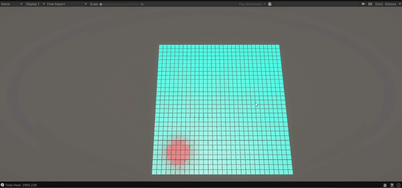

# C++ Unity Heat Diffusion Simulation

A custom C++ numerical physics library integrated into Unity via P/Invoke. Features real-time heat equation diffusion with Neumann boundary conditions and interactive thermal painting.



## Main Features
* **Native Interop:** Built a custom C++ dynamic link library (DLL) communicating with C# via P/Invoke with synchronized memory buffer mapping.
* **Physics & Math:** Implemented explicit finite-difference methods for the 2D heat equation with custom second-derivative stencils and insulated boundary conditions.
* **Interactivity:** Handled runtime state changes, allowing real-time thermal injection and dynamic visual temperature gradients in Unity.

## Running the Project

1. Run the build script to compile the C++ backend:
   ```bash
   ./build.sh
